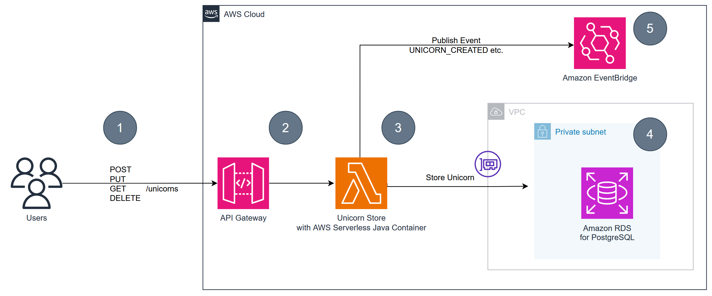
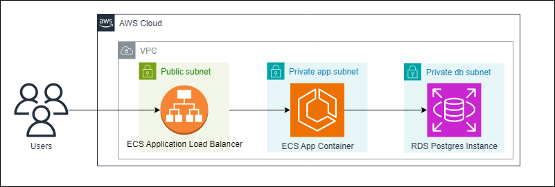

# From Serverful to Serverless Java with AWS Lambda

# Pre-Requisites

1. Install [Java](https://www.oracle.com/java/technologies/downloads/)
2. Install [NodeJS and npm](https://nodejs.org/en/download/package-manager)
3. Install [AWS CDK](https://docs.aws.amazon.com/cdk/latest/guide/getting_started.html)
4. Install [AWS CLI](https://docs.aws.amazon.com/cli/latest/userguide/getting-started-install.html)
5. Install [jq](https://stedolan.github.io/jq/download/)
6. Install [artillery](https://www.artillery.io/docs/guides/getting-started/installing-artillery)
7. Install [git](https://git-scm.com/book/en/v2/Getting-Started-Installing-Git)
8. Install [docker](https://docs.docker.com/engine/install/)
9. An existing AWS account


# Architecture overview

Throughout this workshop we are going to work with an example application named **UnicornStore**.

The UnicornStore is a **Spring Boot Java Application** that provides CRUD-Operations for Unicorn-Records.
It stores them in a relational database (Postgres).

## AWS Serverless Java Container
The following diagram shows the Serverless architecture using AWS Lambda after applying the instructions of the lab:



- (1) End-User can interact with the service via a REST-API that provides basic CRUD operations

  **POST /unicorns**          - Create a new unicorn  
  **PUT /unicorns/{id}**     - Update an existing uncicorn   
  **GET /unicorns/{id}**      - Retrieve an existing unicorn  
  **DELETE /unicorns/{id}**   - Delete an existing unicorn

- (2) The API Gateway proxies the request to the Lambda Function

## AWS ECS Architecture

The following diagram shows the alternative architecture that we are going to
deploy using AWS ECS (AWS's managed container service), to benchmark the AWS Lambda against.



## Setup

Fist make sure that you have authenticated from the command line using
AWS CLI:

```bash
aws configure
```

The following script will build the infrastructure stack on AWS via AWS CDK.

```bash
./setup-infrastructure.sh
```
### AWS Lambda without Snapstart
To deploy the application using AWS Lambda run the below command:

```bash
./deploy.sh spring-lambda --build
```

To test that the application is working properly:

```bash
./test-app.sh spring-lambda
```

To run a load test (using [artillery](https://github.com/artilleryio/artillery)) for the Spring application use the following script:
```bash
./benchmark.sh spring-lambda
```

The results will be saved in the below html file:
```bash
./artillery-lambda.json.html
```
### AWS Lambda using Snapstart

To enhance the performance of the Unicorns application, we are
using AWS's [Snapstart](https://docs.aws.amazon.com/lambda/latest/dg/snapstart.html) 
(which improves the startup time of Java applications deployed on AWS Lambda).
To deploy a different version of the application in a separate 
deployment that uses Snapstart, run the below command:
```bash
./deploy.sh spring-lambda-snapstart --build
```

To test that the application is again working properly:

```bash
./test-app.sh spring-lambda-snapstart
```

To run again a load test for the application deployed with Snapstart, use the following script:
```bash
./benchmark.sh spring-lambda-snapstart
```

The results will be saved in the below html file:
```bash
./artillery-lambda-snapstart.json.html
```

### Deploy the application using AWS ECS
To be able to properly benchmark the application deployed in AWS Lambda,
the application was also deployed to AWS' Elastic Container Service (ECS)
to be able to benchmark the Lambda deployments against.

To deploy the application to AWS ECS, run the below script:
```bash
./build-and-deploy-spring-ecs.sh
```
To test that the application is again working properly:

```bash
./test-app.sh spring-ecs
```

To run again a load test for the application deployed on AWS ECS, use the following script:
```bash
./benchmark.sh spring-ecs
```

The results will be saved in the below html file:
```bash
./artillery-ecs.json.html
```

### Delete all the created resources
To clean the AWS account from the created resources,
run the below command:
```bash
./destroy_all.sh
```
## Security
The project uses [CDK-Nag](https://github.com/cdklabs/cdk-nag) to identify issues with the environment configuration. Since this is workshop environment we are
not using all the capabilities that you might need in production (E.g. Multi-AZ setup). Please refer to the CDK-Nag suppressions in the [CDK-App](infrastructure/cdk/src/main/java/com/unicorn/UnicornStoreApp.java) to identify certain choices
we have made for this setup.